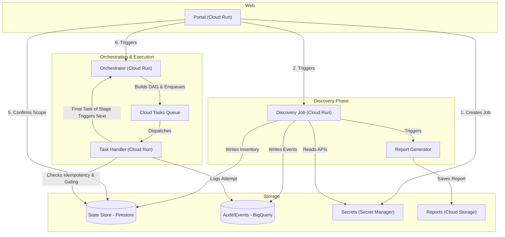

# Architecture — GCP

## 1. Service map

| Service | GCP product | Responsibility |
|---|---|---|
| Portal | Cloud Run (service) | Web UI: enter source/dest API keys, review report, confirm scope, watch progress. |
| Discovery Job | Cloud Run (job) | One-shot: walk source account, build inventory. |
| Report Generator | Cloud Run (service) or part of Discovery Job | Classify inventory using the capability matrix, render downloadable report (PDF/XLSX), estimate cost/time. |
| Orchestrator | Cloud Run (service) or Workflows | Turns confirmed scope into a dependency-ordered task DAG, enqueues Cloud Tasks. |
| Task handler | Cloud Run (service), invoked by Cloud Tasks | Executes one object-copy operation per invocation (create one board / one item / one file / etc). |
| Rate limiter | Library/middleware inside task handler + Cloud Tasks queue config | Token-bucket against monday's complexity budget, per source/destination token. |
| State store | Firestore | Per-object status, ID mapping, retry counts, job metadata, complexity budget, and stage gating counters. |
| Inventory/audit store | BigQuery | Structured event log: one row per discovered object and per copy attempt, for reporting and the final report. |
| Secrets | Secret Manager | Source/destination API keys, scoped per job ID, with TTL cleanup. |
| Scheduled cleanup | Cloud Scheduler | Purges expired job secrets/state after N days. |
| Dashboards | Looker Studio (on BigQuery) or in-portal view | Live progress + final report rendering. |

## 2. Data flow (detailed)

1. **Job creation** — Portal generates a `job_id` (UUID). Both API keys
   are written to Secret Manager under `job_id`-scoped secret names.
   Nothing else references the raw keys; all downstream services fetch
   from Secret Manager by `job_id`.
2. **Discovery** — Cloud Run Job triggered with `job_id`. Paginates
   through source account: workspaces → boards → groups → columns →
   items → subitems → column values → updates → files → docs → articles
   → users/teams. Writes one row per object to Firestore
   (`jobs/{job_id}/inventory/{object_id}`) and BigQuery
   (`inventory_events` table) with type, source ID, name, size/weight
   estimate, and complexity-cost estimate for copying it.
3. **Classification** — Each inventory row is tagged `full` / `partial` /
   `manual_only` per `01-monday-api-capability-matrix.md`, with a caveat
   string attached for non-`full` rows.
4. **Report generation** — Renders the downloadable report (grouped by
   bucket, with counts, estimated total complexity cost, and estimated
   wall-clock time given both accounts' rate limits). Report is stored
   in Cloud Storage and linked from the portal.
5. **Scope confirmation** — Operator reviews in the portal, checks/
   unchecks branches of the tree (e.g., exclude a workspace, exclude
   files), confirms. Confirmed scope is written to Firestore as
   `jobs/{job_id}/scope`.
6. **Orchestration** — Orchestrator reads confirmed scope, builds the
   dependency DAG (workspaces → boards → groups → columns → items →
   subitems → updates → files → docs), and enqueues the first stage's
   tasks into Cloud Tasks. Later stages are enqueued dynamically.
   When the task handler finishes an object, it transactionally decrements
   the stage's remaining task counter in Firestore. The worker that hits
   zero (meaning the stage is complete) triggers the Orchestrator to
   enqueue the next stage. This guarantees dependent IDs exist before
   they're referenced.
7. **Execution** — Cloud Tasks dispatches to the Task Handler service at
   a rate governed by queue config (`max_dispatches_per_second`,
   `max_concurrent_dispatches`) *and* an in-handler token bucket that
   tracks the destination account's live complexity budget (read from
   each response's `complexity` block). On `ComplexityException` (budget exhaustion), the
   handler uses the Re-enqueue Pattern, calculating the exact reset time and pushing the task 
   back into the queue with a future `schedule_time`, then immediately returning a `200 OK` 
   to free the container.
8. **Idempotency** — Before each create-mutation, the handler checks
   Firestore for an existing `source_id → dest_id` mapping; if present,
   skip (already done). This makes retries and job resumption safe.
9. **State updates** — Every attempt (success/fail/retry) updates
   Firestore status and appends a row to the BigQuery `migration_events`
   table (timestamp, object type, source id, dest id, complexity cost,
   status, error message).
10. **Completion & final report** — Once the DAG is fully processed (or
    exhausts retries on remaining items), a final report is generated
    in the same format as the pre-migration report, now with actuals:
    what migrated, what failed (dead-letter, needs manual review), and
    the full manual-only checklist from the classification step.

## 3. Rate limiting design

- **Single Global Execution Token Bucket**: During execution (writes), the system maintains a single transactional token bucket in Firestore (`jobs/{job_id}/state/complexity_bucket`) to govern the destination token's complexity budget.
- **Budget Syncing**: The bucket's capacity is driven by real `complexity.after` and `reset_in_x_seconds` values returned directly in the metadata of every successful live API response (tracked in `src/engines/execution_engine.py` via `_sync_complexity`). We treat the live server value as ground truth over local estimates.
- **Dynamic Re-enqueue Pattern (No Sleeps):** It is a serverless anti-pattern for Cloud Run containers to `sleep()` when hitting a rate limit, as this consumes concurrency slots and incurs unnecessary compute costs. Instead, if a worker encounters an empty token bucket or a `COMPLEXITY_BUDGET_EXHAUSTED` error from Monday.com, it uses the **Re-enqueue Pattern**. The worker calculates the precise reset time, programmatically creates a new Cloud Task that is a clone of the current request, sets its `schedule_time` to the exact future reset moment, and immediately returns `200 OK`. This frees the container instantly.
- **Batched Mutations**: To minimize HTTP overhead, the system prefers using batch mutations like `change_multiple_column_values` where possible, but execution tasks are dispatched one-per-entity to ensure precise idempotency and rollback safety.

## 4. Retry & failure handling

- **The Thundering Herd & Sibling Queues:** Because of Stage Gating, tasks currently in a queue are independent siblings. If the token bucket empties, incoming tasks will rapidly bounce off the empty bucket and re-enqueue themselves into the future. At the exact reset second, a "thundering herd" of tasks will become eligible simultaneously. Cloud Tasks will dispatch them based on `max_concurrent_dispatches`. The first tasks will consume the restored budget, and subsequent tasks will bounce forward again. This naturally and cost-effectively distributes the workload precisely around Monday's dynamic limits.
- **Generic Network Errors:** For transient 5xx errors or network timeouts, the system relies on Cloud Tasks' native queue configuration (exponential backoff with jitter).
- **Permanent failures (validation errors, missing required field, column type unsupported on destination):** Do not retry. The worker marks the entity as `failed_permanent` in Firestore and routes it to the final report's manual-review section.
- After N retries on a transient error, route to a dead-letter queue (separate Cloud Tasks queue or Pub/Sub DLQ topic) for operator review.

## 5. Security notes

- API keys never logged; Cloud Logging sink should have a redaction
  policy for the `Authorization` header.
- Secrets scoped per `job_id`, deleted by Cloud Scheduler after a
  configurable retention window post-completion.
- Explicit consent screen in the portal before Discovery even starts
  (read access) and again before Orchestration starts (write access),
  since two separate customers' data is touched via raw API keys.

## 6. Reusability

The entire pipeline is parameterized by `job_id` and reads both API
keys from Secret Manager at that scope — no hardcoded account
references anywhere. Running a new migration between a different pair
of accounts requires no redeployment, just a new job through the portal.
