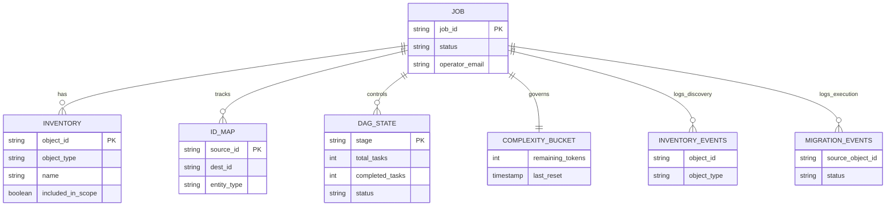
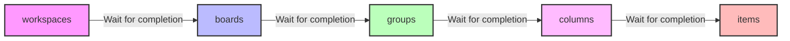

# Data Models & Schemas

## Entity Relationship Diagram



## 1. Firestore

### `jobs/{job_id}`
```
{
  job_id: string,
  created_at: timestamp,
  status: "created" | "discovering" | "report_ready" | "scope_confirmed"
        | "running" | "completed" | "failed" | "aborted",
  source_account: { secret_ref: string },   // Secret Manager reference, not the key itself
  dest_account:   { secret_ref: string },
  operator_email: string,
  expires_at: timestamp   // for Cloud Scheduler cleanup
}
```

### `jobs/{job_id}/inventory/{object_id}`
```
{
  object_id: string,          // source-account object ID
  object_type: "workspace" | "board" | "group" | "column" | "item"
             | "subitem" | "update" | "file" | "doc" | "article" | "user",
  parent_object_id: string | null,
  name: string,
  classification: "full" | "partial" | "manual_only",
  caveat: string | null,
  estimated_complexity_cost: number,
  included_in_scope: boolean   // set after operator confirms scope
}
```

### `jobs/{job_id}/id_map/{entity_type}_{source_id}`
```
{
  source_id: string,
  dest_id: string,
  entity_type: "workspace" | "board" | "group" | "column" | "item",
  created_at: timestamp
}
```
This table serves as the primary idempotency check. It is queried before any create mutation and populated immediately upon success.

### `jobs/{job_id}/state/complexity_bucket`
```
{
  remaining_tokens: number,
  last_reset: timestamp
}
```
Replaces the proposed in-memory rate limiter with a global, transactional Token Bucket in Firestore. It is actively decremented proactively by the Cloud Tasks workers (e.g. `consume_budget`) and reactively resynced with the exact metadata returned from the Monday.com GraphQL API.

### `jobs/{job_id}/dag_state/{stage}`
```
{
  total_tasks: number,
  completed_tasks: number,
  status: "pending" | "completed"
}
```
This schema gates the execution DAG (Directed Acyclic Graph). In this project, the DAG acts as a **strict sequential pipeline** ensuring dependency order is maintained when recreating the Monday.com hierarchy. 

The exact execution order is defined by the Orchestration Engine as:
**`workspaces`** -> **`boards`** -> **`groups`** -> **`columns`** -> **`items`**



*   **Initialization:** Before execution, the orchestration engine writes one document per stage (e.g., `boards: {total_tasks: 50, completed_tasks: 0, status: "pending"}`).
*   **Progress Tracking:** As Cloud Task workers finish migrating individual objects, they transactionally increment `completed_tasks`.
*   **Stage Gating:** When `completed_tasks` reaches `total_tasks` for a given stage, the current stage is marked `status: "completed"`, and the orchestrator is triggered to enqueue all Cloud Tasks for the subsequent stage in the pipeline.

## 2. BigQuery

### `inventory_events` (append-only, written during Discovery)
| column | type |
|---|---|
| job_id | STRING |
| object_id | STRING |
| object_type | STRING |
| classification | STRING |
| estimated_complexity_cost | INT64 |
| discovered_at | TIMESTAMP |

### `migration_events` (append-only, written during Execution)
| column | type |
|---|---|
| job_id | STRING |
| source_object_id | STRING |
| dest_object_id | STRING |
| object_type | STRING |
| attempt_number | INT64 |
| complexity_cost | INT64 |
| status | STRING |  -- success / retry / failed_transient / failed_permanent
| error_message | STRING |
| event_at | TIMESTAMP |

These two tables are what the report generator and the live dashboard
both query — pre-migration report reads `inventory_events`, live
progress and final report read `migration_events` joined back to
`inventory_events`.

## 3. Cloud Tasks payload shape

Each task represents exactly one object-copy operation. The payload reflects the shape expected by the worker routes after being built by the Orchestration Engine:
```json
{
  "job_id": "string",
  "task": {
    "entity_type": "workspace" | "board" | "group" | "column" | "item",
    "source_id": "string",
    "payload": { ... } // Original entity metadata from the inventory
  }
}
```

*Note on Retries (The Re-enqueue Pattern):* When a task encounters an empty Token Bucket, it does not rely on Cloud Tasks' native HTTP 429 backoff. Instead, it creates a new task using this **exact same payload shape**, but sets the Cloud Tasks `schedule_time` parameter to the exact moment the rate limit resets, and returns `200 OK` for the current execution.

*Note on Dependencies:* Earlier designs proposed a `depends_on: [string]` field resolved dynamically at execution time. This has been replaced by **stage gating**. The Orchestration Engine guarantees that no task for a stage (e.g., `groups`) is enqueued until all tasks for its prerequisite stage (e.g., `boards`) have completed fully and their IDs are mapped in the `id_map` collection.

## 4. Rate-limiter state (per job, per direction)

Kept in-memory in the handler (or Redis/Memorystore if you need it
shared across handler instances) rather than Firestore, since it needs
sub-second read/write performance:
```
{
  token: "source" | "dest",
  budget_per_minute: number,      // from account plan tier, checked at discovery time
  used_this_window: number,
  window_reset_at: timestamp
}
```
Updated from the `complexity { before after }` block on every real API
response — treat the live server value as ground truth over the local
estimate whenever they diverge.
